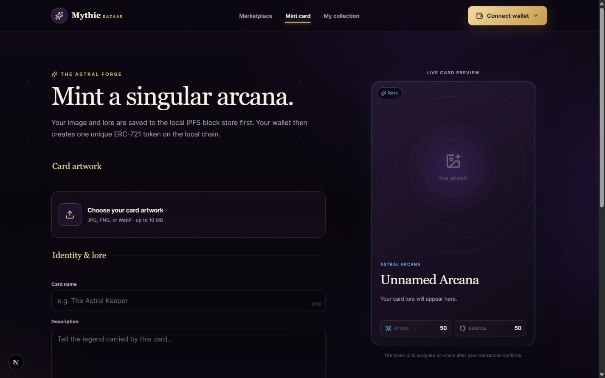

# Mythic Bazaar

Mythic Bazaar is a full-stack NFT marketplace for collectible celestial game cards. Players can upload artwork, create OpenSea-compatible metadata, mint an ERC-721 card, list it at a fixed ETH price, purchase cards, and cancel their own listings.

The current development workflow runs entirely on a local Hardhat testnet. NFT ownership and marketplace listings are read from the smart contracts; no application database is required.

## Project overview & features

- **Create collectible cards** with artwork, lore, rarity, element, attack, and defense attributes.
- **Mint ERC-721 NFTs** through an injected browser wallet such as MetaMask.
- **Store artwork and metadata by CID** in the built-in local IPFS-compatible block store.
- **Browse the marketplace** with name/token search, rarity filters, and price sorting.
- **Trade at a fixed ETH price** through protected NFT escrow.
- **Manage a collection** of owned cards and active escrow listings.
- **Cancel listings** and return escrowed cards to the seller.
- **Settle purchases atomically**: the NFT moves to the buyer and the full payment moves to the seller in one transaction.
- **Pay no platform fee or royalty** in the current contracts.
- **Reject unsafe transfers and calls** with exact-price checks, self-purchase prevention, guarded ERC-721 receipt, and reentrancy protection.
- **Run without centralized application state**; contract reads provide ownership and listing data.

> [!WARNING]
> The contracts have automated test coverage but have not received a professional security audit. They are intended for development and testnet use only.

## Tech stack

| Layer | Technology |
| --- | --- |
| Web app | Next.js 16 App Router, React 19, TypeScript 6 |
| Wallet and chain access | wagmi 3, viem 2, TanStack Query |
| Smart contracts | Solidity 0.8.34, OpenZeppelin Contracts 5 |
| Development chain | Hardhat 3, Hardhat Ignition |
| NFT standard | ERC-721 Enumerable + URI Storage |
| Styling | Custom responsive CSS, Lucide React icons |
| Content storage | Local IPFS-compatible CID block store; optional HTTP gateway for reads |
| Testing | Hardhat contract tests, Vitest, Testing Library, jsdom |
| Quality checks | ESLint and TypeScript |

## Setup instructions

### Prerequisites

- Node.js 20.9 or newer and npm
- A browser wallet such as MetaMask
- Windows PowerShell for the encrypted test-wallet helper scripts

All ETH used below is local test ETH with no monetary value.

### 1. Install dependencies

```bash
npm install
```

### 2. Create a local test wallet

Run this once:

```bash
npm run wallet:create
```

The helper encrypts the private key with Windows Data Protection API and saves it under the gitignored `.mythic/` directory. Display or validate the wallet with:

```bash
npm run wallet:address
npm run wallet:validate
```

### 3. Start the local Ethereum testnet

Keep this command running in its own terminal:

```bash
npm run chain:local
```

The JSON-RPC endpoint is `http://127.0.0.1:8545` and the chain ID is `31337`.

### 4. Fund the wallet and deploy the contracts

In a second terminal:

```bash
npm run wallet:fund-local
npm run deploy:local
```

The deployment command prints the fresh `MythicCards` and `MythicMarketplace` addresses. Local blockchain state is ephemeral, so repeat these commands after restarting or resetting the Hardhat node.

### 5. Configure the app

Copy the example environment file:

```powershell
Copy-Item .env.example .env.local
```

Update `.env.local` with the addresses printed by the deployment:

```dotenv
NEXT_PUBLIC_LOCAL_RPC_URL=http://127.0.0.1:8545
NEXT_PUBLIC_NFT_CONTRACT_ADDRESS=0x...
NEXT_PUBLIC_MARKETPLACE_CONTRACT_ADDRESS=0x...
NEXT_PUBLIC_IPFS_GATEWAY=
```

Leave `NEXT_PUBLIC_IPFS_GATEWAY` empty to use the built-in local content store. Restart the web app whenever a `NEXT_PUBLIC_` value changes.

### 6. Connect MetaMask

Add a custom network using:

| Setting | Value |
| --- | --- |
| Network name | Mythic Localhost |
| RPC URL | `http://127.0.0.1:8545` |
| Chain ID | `31337` |
| Currency symbol | `ETH` |

To import the encrypted test wallet into MetaMask, run:

```bash
npm run wallet:copy-key
```

Import the clipboard value through MetaMask's **Import account** flow, then immediately replace the clipboard contents. Never use this wallet on a public network or fund it with real assets.

### 7. Start the web app

```bash
npm run dev
```

Open [http://localhost:3000](http://localhost:3000).

### Validation commands

```bash
npm run compile
npm run test
npm run typecheck
npm run lint
npm run build
```

For a local production preview:

```bash
npm run build
npm run start
```

## Testnet & contract addresses

### Active development network

| Network | Chain ID | RPC URL | Explorer |
| --- | ---: | --- | --- |
| Hardhat localhost | `31337` | `http://127.0.0.1:8545` | Not available |

A clean local deployment currently produces these deterministic addresses:

| Contract | Local address |
| --- | --- |
| `MythicCards` | `0x5FbDB2315678afecb367f032d93F642f64180aa3` |
| `MythicMarketplace` | `0xe7f1725E7734CE288F8367e1Bb143E90bb3F0512` |

These addresses are only valid while the matching local Hardhat node is running. Always use the addresses printed by your own `npm run deploy:local` command.

### Recorded Sepolia deployment

The repository also contains a previous Ignition deployment record for Ethereum Sepolia (`11155111`):

| Contract | Sepolia address |
| --- | --- |
| `MythicCards` | [`0x5948e86084f77B329e7c6bd466bF3645aEF41551`](https://sepolia.etherscan.io/address/0x5948e86084f77B329e7c6bd466bF3645aEF41551) |
| `MythicMarketplace` | [`0x704BC79517c5e25ed85f25D23d422A5D2D6FaaA7`](https://sepolia.etherscan.io/address/0x704BC79517c5e25ed85f25D23d422A5D2D6FaaA7) |

The current frontend and Hardhat configuration target the local network, not Sepolia. Additional RPC/network configuration is required before using the recorded Sepolia contracts from the app.

## IPFS implementation

Mythic Bazaar uses `ipfs://` URIs in NFT metadata while providing a zero-dependency local storage implementation for development:

1. The mint form sends the selected JPG, PNG, or WebP file to `POST /api/ipfs`.
2. The server hashes the bytes with SHA-256 and builds a base32 CIDv1 using the raw codec.
3. The block and its content type are saved under the gitignored `.mythic/ipfs/` directory.
4. The client creates OpenSea-compatible JSON metadata containing the image's `ipfs://<CID>` URI.
5. The JSON file is uploaded through the same endpoint and receives its own CID.
6. Only `ipfs://<metadata-CID>` is written to the `MythicCards` contract.
7. `GET /api/ipfs/[cid]` resolves local blocks with immutable cache headers, while `ipfsToHttp` converts `ipfs://` values into browser-readable URLs.

The upload API accepts:

- JPG, PNG, and WebP images up to 10 MB
- Valid JSON metadata up to 64 KB

Setting `NEXT_PUBLIC_IPFS_GATEWAY` changes how existing `ipfs://` content is read, for example `https://gateway.example/ipfs/<CID>`. It does **not** publish locally uploaded blocks to a public IPFS network. For a hosted deployment, replace or extend the local upload route with a persistent IPFS node or pinning service and add authentication, rate limiting, replication, and retention controls.

## Screenshots

### Marketplace


### Mint card



## Smart contract notes

- Token IDs start at `1` and increase after each successful mint.
- Anyone can mint a card; there is no contract-level mint fee.
- The marketplace accepts only the deployed `MythicCards` collection.
- Creating a listing transfers the NFT into marketplace escrow.
- Purchases require the exact listed price and transfer 100% of it to the seller.
- Sellers cannot purchase their own listings.
- Direct ETH payments and unsolicited NFT transfers are rejected.
- Auctions, offers, royalties, marketplace fees, bundles, and mainnet deployment are outside the current scope.
